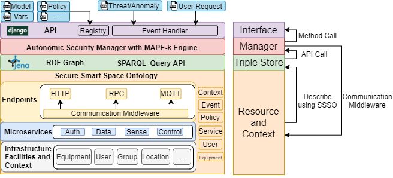
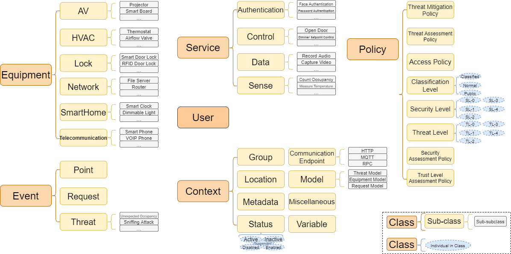

# SSSO-AutoSecMng
The reproducible artifact repository for the paper "Autonomic Security Management for IoT Smart Spaces."
## Citation
The paper is available [here](https://pacs.eecs.yorku.ca/pubs/pdf/lin2021autonomic.pdf).

BibTex

```
@article{10.1145/3466696,
author = {Lin, Changyuan and Khazaei, Hamzeh and Walenstein, Andrew and Malton, Andrew},
title = {Autonomic Security Management for IoT Smart Spaces},
year = {2021},
issue_date = {November 2021},
publisher = {Association for Computing Machinery},
address = {New York, NY, USA},
volume = {2},
number = {4},
issn = {2691-1914},
doi = {10.1145/3466696},
month = aug,
articleno = {27},
}

```

## Overview of the methodology
### Autonomic Security Management

### Secure Smart Space Ontology
. Each box is a top-level class in SSSO. The solid lines represent object properties. Examples of relationships among classes are described by dotted lines.")

* Generic ontology specifically for describing security-enhanced systems backed by connected devices leveraging the microservice architecture.
* Autonomic security manager that maintains the security of smart spaces adaptively with the MAPE-k method.
* Solution to a current customer problem of BlackBerry, verified by a series of 160 events. Performance evaluated by a large-scale deployment with over 1.8 million triples.
* Ready-to-use, easy-to-deploy, and scalable.

## Artifacts
* [Secure Smart Space Ontology](./Ontology/ssso.ttl)
* [Autonomic Security Manager](./SSSO)
* [Triple Store Layer](./jena-fuseki-ssso)
* [Interface Layer](./Interface)
* [Evaluation with 160 Events](./160Events/Events-160.ipynb)
* [Performance Evaluation](./Performance/Performance-Evaluation.ipynb)

## Requirements
* Python >= 3.8.2
* pip >= 19.1.1
* Docker Engine >= 19.03.8 ([Installation Guide](https://docs.docker.com/engine/install/))

Required Python packages are listed in requirements.txt

Installation:
```
pip install -r requirements.txt
```


## Usage
### Ontology
The Secure Smart Space Ontology in TTL (turtle) notation is available [here](./Ontology/ssso.ttl).
### Autonomic Security Management
#### Triple Store
The implementation of the triple store layer is based on [Apache Jena](https://jena.apache.org/index.html) and its [Docker Image](https://github.com/stain/jena-docker). 
We develop [a ready-to-use Docker image](./jena-fuseki-ssso) with pre-loaded [SSSO data set](./Ontology/ssso.ttl).
The steps to set up the triple store layer are as follows.

* Build image
```
cd ./jena-fuseki-ssso
docker build -t jena-fuseki-ssso .
```

* Container deployment
```
docker run -d -p 3030:3030 -e ADMIN_PASSWORD=password jena-fuseki-ssso
```
The triple store layer will be running on http://your-ip-address:3030/SSSO
The default username is 'admin', and the password is 'password'.

For reproducing the [results of performance evaluation](./Performance/Performance-Evaluation.ipynb), please load the large scale data set [large-scale.nq.gz](./Performance/large-scale.nq.gz) into Apache Jena using the in-built [web panel](http://your-ip-address:3030/manage.html).

#### Autonomic Security Manager and Interface
The autonomic security manager and the Django-based interface are encapsulated as a [Docker image](./Interface) as well.
The steps to set up the manager and interface layers are as follows.
* Build image
```
cd ./Interface
docker build -t asminterface .
```

* Container deployment
```
docker run -d -p 3031:8000 -e "JENA_ADDRESS=http://your-ip-address:3030/SSSO" asminterface
```
The interface will be running on http://your-ip-address:3031 
The manager supports triple store layers based on Jena or local turtle file. 
The environment variable "JENA_ADDRESS" specifies the address of the triple store layer based on Jena.
The local turtle file triple store layer will be used if "JENA_ADDRESS" is unset.
The triple store layer based on Apache Jena is highly recommended for better performance.

For the usage of the autonomic security manager, please refer to the [Jupyter notebook](./160Events/Events-160.ipynb).
The interface offers exactly the same methods as defined in the autonomic security manager.
